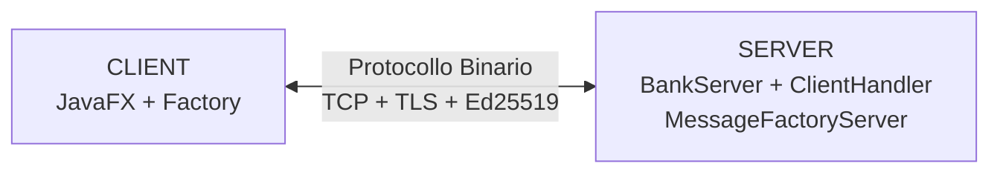
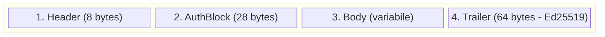
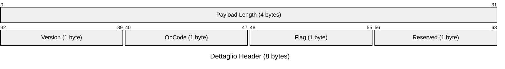
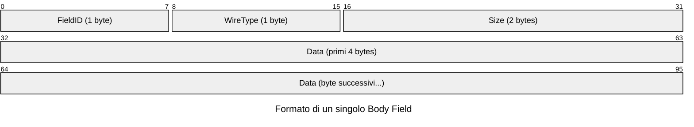
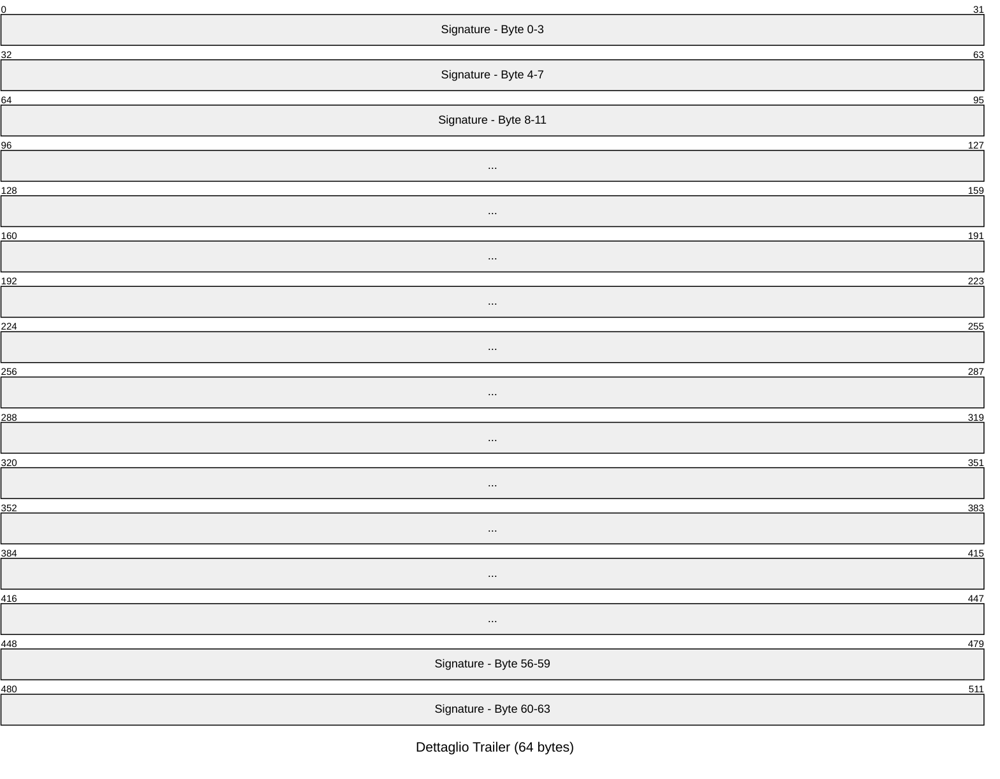
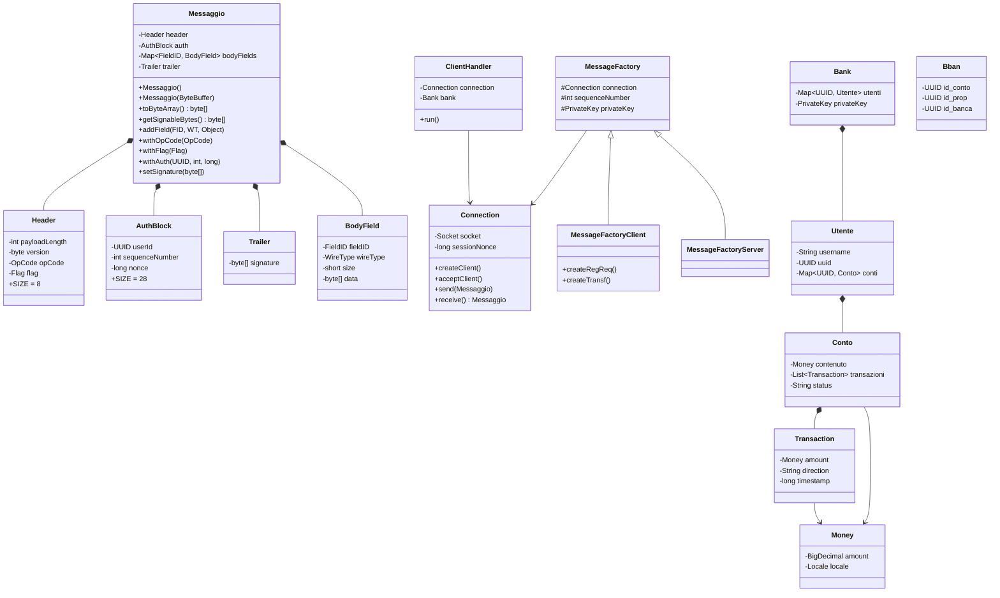
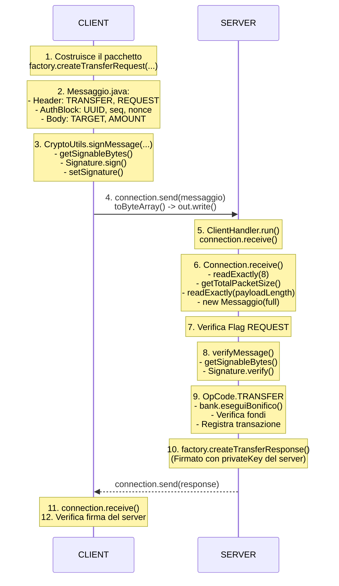

# Architettura del Protocollo Bancario Binario

## Indice

1. [Panoramica](#1-panoramica)
2. [Struttura del pacchetto wire](#2-struttura-del-pacchetto-wire)
3. [Diagramma delle classi](#3-diagramma-delle-classi)
4. [Flusso di una transazione](#4-flusso-di-una-transazione)
5. [Gestione della memoria](#5-gestione-della-memoria)
6. [Estendibilità](#6-estendibilità)

---

## 1. Panoramica



Il protocollo è il **livello di trasporto e presentazione** tra un client
bancario e un server. Definisce esattamente come:

- I pacchetti vengono frammentati e ricostruiti su TCP
- I dati vengono serializzati in forma binaria
- Le richieste vengono autenticate tramite firma Ed25519
- Il server risponde con messaggi strutturati

---

## 2. Struttura del pacchetto wire

La struttura del pacchetto è composta da quattro blocchi principali. Per superare i limiti di visualizzazione ed evitare distorsioni, ogni sezione è dettagliata individualmente qui sotto, mostrando la corretta mappatura dei byte (32 bit per riga).



### 1. Header (8 bytes)



### 2. AuthBlock (28 bytes)


### 3. Body (Dimensione variabile)

Il Body contiene zero o più campi, ciascuno formattato come segue:



### 4. Trailer (64 bytes)

Contiene la firma Ed25519 dell'intero pacchetto (Header + AuthBlock + Body). A scopo illustrativo, sono mostrate solo le righe iniziali e finali per rappresentare i 64 byte (16 blocchi da 4 byte).



---

## 3. Diagramma delle classi



---

## 4. Flusso di una transazione

### 4.1 Invio di un bonifico (passo dopo passo)



---

## 5. Gestione della memoria

### 5.1 ByteBuffer e letture esatte

Il metodo `readExactly()` in `Connection.java` garantisce che un'interruzione
di TCP non causi letture parziali:

```
readExactly(InputStream, byte[] dest):
  offset = 0
  while offset < dest.length:
    read = stream.read(dest, offset, dest.length - offset)
    if read == -1: throw EOFException
    offset += read
```

Questo è fondamentale perché TCP può frammentare i dati in pacchetti arbitrari.

### 5.2 Allocazione del ByteBuffer

La serializzazione alloca ByteBuffer di dimensione esatta:

```
Header.SIZE + payloadLength
= 8 + (AuthBlock.SIZE + bodyBytes.length + Trailer.SIGNATURE_SIZE)
= 8 + (28 + N + 64)
= 100 + N byte  (dove N è la dimensione del Body)
```

Questo previene il riallocamento e la copia di array durante la costruzione.

### 5.3 Serializzazione del Body

Il body viene serializzato in due passate:
1. **Prima passata**: calcola la dimensione totale di tutti i BodyField
2. **Seconda passata**: scrive i byte in un ByteBuffer della dimensione calcolata

Questo permette di sapere la dimensione finale del body prima di scrivere
l'header, risolvendo il problema della firma su un messaggio che contiene
la propria lunghezza.

---

## 6. Estendibilità

### 6.1 Aggiungere un nuovo OpCode

1. Aggiungere il valore nell'enum `OpCode.java`
2. Aggiungere un metodo factory in `MessageFactoryClient` e `MessageFactoryServer`
3. Aggiungere un case nello switch di `ClientHandler.handleAuthenticated()`

Nessun cambiamento al formato wire o alla serializzazione

### 6.2 Aggiungere un nuovo FieldID

1. Aggiungere il valore nell'enum `FieldID.java`
2. Aggiungere un campo nel Body del messaggio con `.addField()`

Nessun cambiamento al parsing, funziona subito.

### 6.3 Aggiungere un nuovo WireType

1. Aggiungere l'enum in `WireType.java` con implementazioni di `toBytes()` e `fromBytes()`
2. Usare il nuovo tipo nei BodyField

### 6.4 Modificare l'Header

Basta modificare:
1. La costante `SIZE` in `Header`
2. Il costruttore `Header(ByteBuffer)`
3. `toByteBuffer()`

Il resto di `Messaggio.java` non cambia.

### 6.5 Aggiungere una nuova sezione al pacchetto

Per aggiungere, ad esempio, una sezione `Metadata` tra `Body` e `Trailer`:
1. Creare la classe `Metadata` con `SIZE`, `toByteBuffer()`, costruttore da `ByteBuffer`
2. Aggiungere il campo in `Messaggio`
3. Aggiornare `getSignableBytes()` e `toByteBuffer()` e il costruttore da `ByteBuffer`

Ogni sezione è **completamente indipendente** dalle altre.

---

## Riferimenti

- [README.md](README.md) — Quick start e documentazione generale
