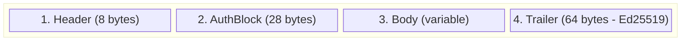
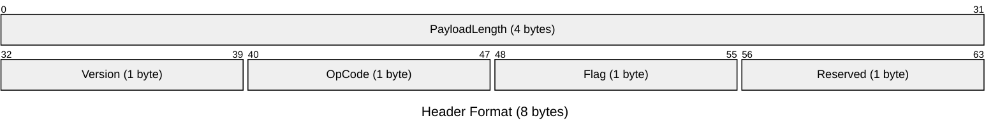
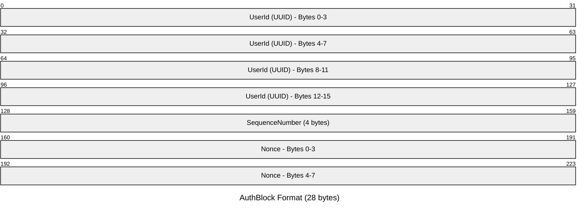
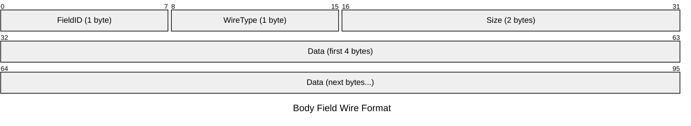
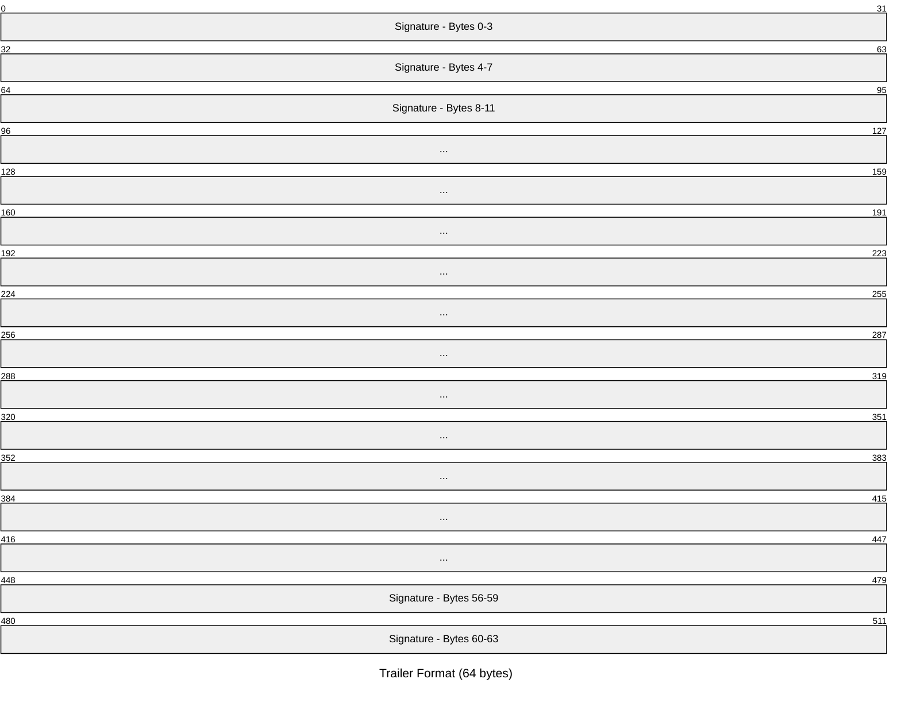
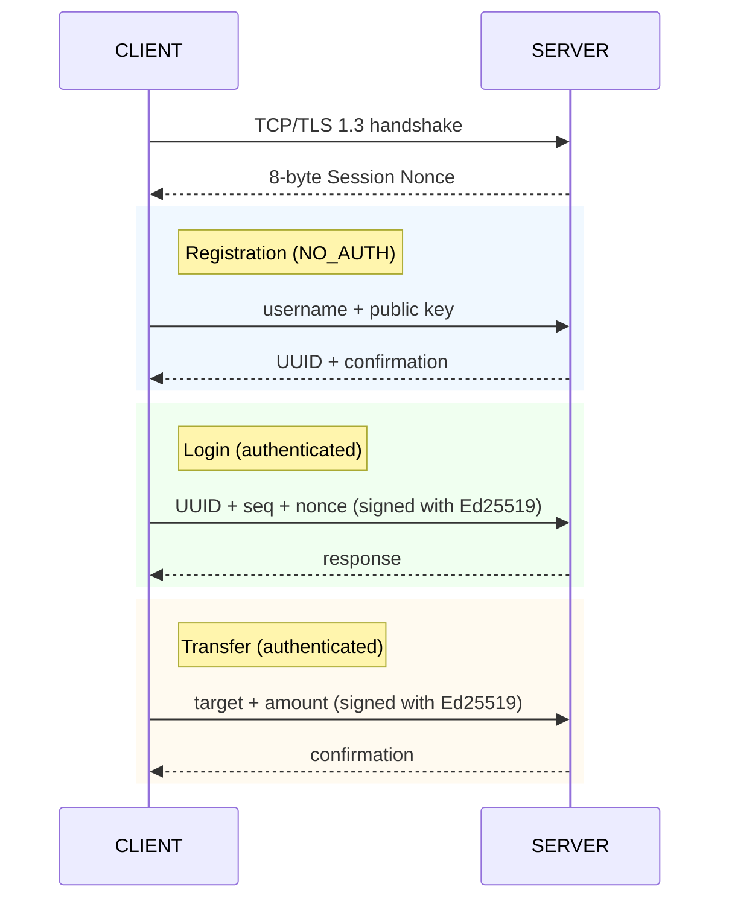

# BancarioFaccia Protocol

> **Binary TCP banking protocol — self-describing, authenticated, and signed.**

[](https://java.com)
[](https://en.wikipedia.org/wiki/Transport_Layer_Security)
[](https://en.wikipedia.org/wiki/EdDSA)
[](LICENSE)

---

## Overview

BancarioFaccia is a **binary protocol over TCP** designed for secure bank communications.
Every packet is self-framing and self-describing — no JSON, no XML, no HTTP.

**Design principles:**

- **No sessions** — each request carries its own Ed25519 signature
- **No ambiguity** — every byte on the wire has a defined meaning
- **Extensible** — new fields can be added without breaking backward compatibility
- **Anti-replay** — each message includes a server-provided nonce + monotonic sequence number

---

## Packet Structure



### 1. Header (8 bytes) — Fixed-size frame prefix



| Offset | Size | Field         | Description                              |
|--------|------|---------------|------------------------------------------|
| 0      | 4    | PayloadLength | Length of AuthBlock + Body + Trailer     |
| 4      | 1    | Version       | Protocol version (0x01)                  |
| 5      | 1    | OpCode        | Operation code (Transfer, Balance, …)    |
| 6      | 1    | Flag          | Request / Response / Error / NoAuth      |
| 7      | 1    | Reserved      | Alignment (0x00)                         |

The 4-byte payload length at offset 0 enables **TCP framing**: after reading exactly 8 header
bytes, the receiver knows exactly how many more bytes to read for the complete packet.

### 2. AuthBlock (28 bytes) — Identity & anti-replay



| Offset | Size | Field          | Description                           |
|--------|------|----------------|---------------------------------------|
| 0      | 16   | UserId         | UUID (16 bytes) of the client         |
| 16     | 4    | SequenceNumber | Monotonic counter for anti-replay     |
| 20     | 8    | Nonce          | Server-generated session challenge    |

Omitted when `Flag == NO_AUTH` (registration requests).

### 3. Body (variable) — Self-describing fields

Each field on the wire:



**Supported WireTypes:**

| Byte | Type         | Description                    |
|------|--------------|--------------------------------|
| 0x01 | `LONG`       | 8-byte signed long             |
| 0x02 | `MONEY`      | Self-describing `PreciseMoney` |
| 0x03 | `STRING`     | UTF-8 string                   |
| 0x04 | `PUBLIC_KEY` | X.509-encoded Ed25519 key      |
| 0x05 | `BBAN`       | 48-byte bank account reference  |
| 0x06 | `INT`        | 4-byte signed integer          |
| 0x07 | `BYTE_ARRAY` | Raw bytes                      |

### 4. Trailer (64 bytes) — Ed25519 signature



Ed25519 signature over `Header + AuthBlock + Body`:
- 64 bytes, fixed
- Signed with the sender's private key
- Verified with the sender's public key

---

## OpCodes

| Byte | OpCode               | Description                    |
|------|----------------------|--------------------------------|
| 0x00 | `ACCOUNT_CREATION`   | Register new user              |
| 0x01 | `TRANSFER`           | Send money                     |
| 0x02 | `BALANCE`            | Check balance                  |
| 0x03 | `CONFIRMATION`       | Generic confirmation           |
| 0x04 | `REGISTRATION_CONFIRMATION` | Registration OK        |
| 0x05 | `TRANSACTION_HISTORY` | Get past transactions          |
| 0x06 | `CREATE_ACCOUNT`     | Open a new sub-account         |
| 0x07 | `VALIDATE_BBAN`      | Check if a BBAN exists         |
| 0x08 | `LOGIN`              | Authenticate with signed challenge |
| 0x09 | `FETCH_ACCOUNTS`     | List user's accounts           |
| 0x0A | `REQUEST_CERTIFICATE`| Get a bank-signed certificate  |
| 0x0B | `RENAME_ACCOUNT`     | Change account name            |
| 0x0C | `SET_ACCOUNT_STATUS` | Freeze / unfreeze account      |
| 0x0D | `FETCH_EXCHANGE_RATES` | Get currency conversion rates |

---

## Flags

| Byte | Flag               | Description                         |
|------|--------------------|-------------------------------------|
| 0x00 | `REQUEST`          | Authenticated request               |
| 0x01 | `RESPONSE`         | Successful response                 |
| 0x02 | `ERROR`            | Error response                      |
| 0x04 | `ASYNC`            | Server-pushed message               |
| 0x08 | `NO_AUTH`          | Unauthenticated request (no AuthBlock) |

---

## Authentication Flow



Every **authenticated** message must:
1. Include the server's 8-byte nonce (anti-replay across sessions)
2. Include a monotonic sequence number (anti-replay within session)
3. Be signed with the client's Ed25519 private key

---

## Quick Start

### Prerequisites
- JDK 21+
- Maven or your preferred build tool

### Compile
```bash
javac -d out src/main/java/org/example/bancariofaccia/protocol/**/*.java
```

### Run Server
```bash
java -cp out org.example.bancariofaccia.protocol.BankServer
```

The server automatically:
1. Generates a self-signed TLS keystore (`server.p12`) if missing
2. Loads bank state from `bank_data.ser` if it exists
3. Listens on port **8443** with TLS 1.3

### Connect a Client
```java
Connection conn = Connection.createClient("localhost", 8443);
long nonce = conn.getSessionNonce();

// Register
MessageFactoryClient factory = new MessageFactoryClient(conn);
KeyPair kp = CryptoUtils.generateKeyPair();
Messaggio regMsg = factory.CreaMessaggioDiRichiestaCreazioneAccount("alice", kp.getPublic());
conn.send(regMsg);
Messaggio response = conn.receive();
```

---

## Project Structure

```
protocol/
├── Bank/                      # Domain model
│   ├── Bank.java              # Central bank logic, ser/deser
│   ├── Bban.java              # 48-byte binary bank account number
│   ├── Conto.java             # Account entity
│   ├── Transaction.java       # Transfer record
│   └── Utente.java            # User entity
├── Messaggi/                  # Binary protocol
│   ├── Messaggio.java         # Core packet: Header, AuthBlock, BodyField, Trailer
│   ├── Connection.java        # TLS transport + nonce exchange + send/receive
│   ├── ClientHandler.java     # Server-side dispatcher
│   ├── FieldID.java           # Body field identifiers
│   ├── OpCode.java            # Operation codes
│   ├── WireType.java          # Wire serializers (Long, Money, String, …)
│   ├── Flag.java              # Packet flags
│   └── MessageFactory/        # Builder helpers
│       ├── MessageFactory.java
│       ├── MessageFactoryClient.java
│       └── MessageFactoryServer.java
├── PreciseMoney/              # Value-object money
│   └── Money.java             # Locale-aware, currency-safe, binary-serializable
├── UTILS/                     # Utilities
│   ├── CryptoUtils.java       # Ed25519 sign & verify
│   ├── AsymmetricParser.java  # Key deserialization
│   └── HexDump.java           # Debug hex output
├── BankServer.java            # TLS server entry point
├── test.java                  # Dev scratch
├── README.md
├── ARCHITETTURA.md
└── LICENSE
```

---

## Why Binary?

| Concern              | JSON / HTTP                     | BancarioFaccia binary            |
|----------------------|----------------------------------|----------------------------------|
| Packet size          | 500–2000+ bytes                  | ~100–300 bytes                   |
| Parsing              | String parsing, validation       | Direct byte buffer reads         |
| Typing               | Strings everywhere               | Native types (long, UUID, Money) |
| Signing              | Sign raw bytes of chosen fields  | Sign entire deterministic packet |
| Framing              | Content-Length header            | Fixed 8-byte prefix with length  |

Every byte has a precise meaning. No serialization framework — you control the wire format.

---

## Security

- **Transport**: TLS 1.3 with mutual authentication (server cert verified)
- **Message authentication**: Ed25519 digital signature per packet
- **Anti-replay**: 8-byte random nonce (per connection) + 4-byte sequence number (per message)
- **Key pair**: Ed25519, generated client-side, public key sent during registration
- **No session tokens**: Each request is independently verifiable

---

## License

MIT — see [LICENSE](LICENSE).
